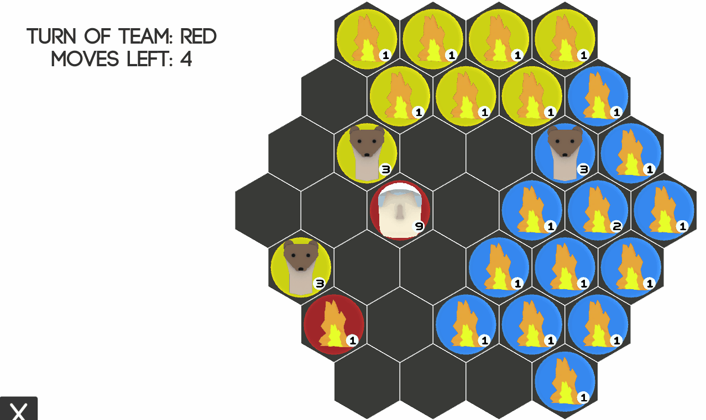

# Fire, Pope and a Weasel

A joke (but functional) game. A tactical turn-based board game to be precise.
## Rules:
- The goal is to destroy all enemy units.
- Each turn player gets 3 Action Points. They can be used to:
    - Move a unit
    - Interact with adjacent enemy unit (if it can beat it)
    - Fuse 2 friendly units

### There are 3 types of units:  
- `Fire`:
    - Quickly spreads(can spawn new `Fire` in adjacent field),
    - It can burn enemy `Popes`,
    - Can be put out by `Weasel`,
    - Fusing 3 `Fires` will create a `Weasel`.
- `Weasel`:
    - Can move to adjacent fields,
    - Can put out an enemy `Fire`,
    - Can be converted by enemy `Popes`,
    - Fusing 3 `Weasels` will create a `Pope`.
- `Pope`:
    - Can move to adjacent fields,
    - Can convert enemy `Weasels`,
    - Can be burned by enemy `Fire`,
    - Grants additional move per turn.
### In general we have Rock-Paper-Scissors dynamic:
- Pope converts the Weasel.
- Weasel put out the Fire.
- Fire burns the Pope.

## Current build:
- mouse controls
- up to 6 players
## TO DO:
- no win/draw condition check - sometimes there can be, lock that stops you from finishing the game (e.g. each player has only 1 weasel left)
- custom board creator
- android build

Footage of windows build:
